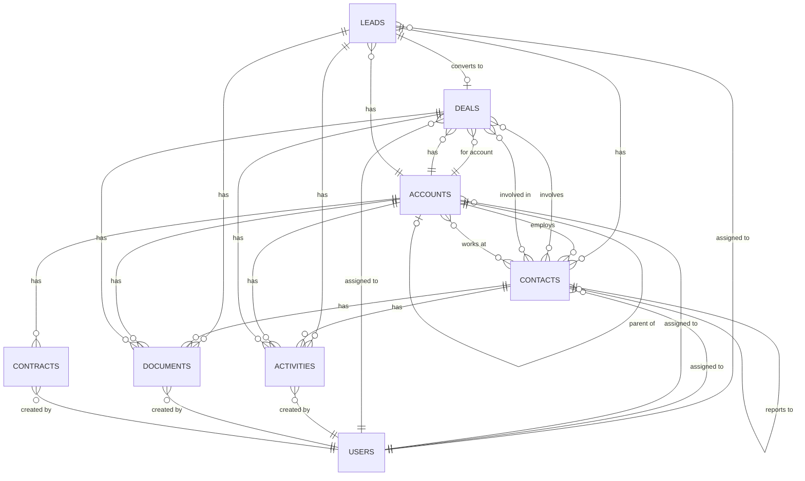

# Module Relationships Diagram

## Overview
This document visualizes the relationships between the Leads, Contacts, Accounts, and Deals modules in the MakeDeal CRM system.

## Entity Relationship Diagram



## Module Relationships Detail

### 1. Leads Module Relationships

```
LEADS
├── → DEALS (1:1) - Conversion relationship
│   └── converted_deal_id links to deals.id
├── → CONTACTS (1:M) - Lead contact information
├── → USERS (M:1) - Assignment
│   ├── assigned_user_id
│   ├── created_by
│   └── modified_user_id
├── → ACTIVITIES (1:M) - Related activities
│   ├── Calls (parent_type = 'mdeal_Leads')
│   ├── Meetings
│   ├── Tasks
│   ├── Notes
│   └── Emails
├── → DOCUMENTS (M:M) - Attached documents
│   └── via mdeal_leads_documents
└── → CAMPAIGNS (M:1) - Source campaign
    └── campaign_id
```

### 2. Contacts Module Relationships

```
CONTACTS
├── ↔ DEALS (M:M) - Deal involvement
│   └── via mdeal_contacts_deals
│       ├── contact_role
│       └── primary_contact flag
├── ↔ ACCOUNTS (M:M) - Company affiliations
│   └── via mdeal_contacts_accounts
│       ├── title
│       ├── department
│       └── is_primary flag
├── → ACCOUNTS (M:1) - Primary employer
│   └── account_id
├── → CONTACTS (M:1) - Reporting structure
│   └── reports_to_id (self-referential)
├── → USERS (M:1) - Assignment
│   ├── assigned_user_id
│   ├── created_by
│   └── modified_user_id
├── → ACTIVITIES (1:M) - Related activities
│   ├── Calls
│   ├── Meetings
│   ├── Tasks
│   ├── Notes
│   └── Emails
└── → DOCUMENTS (M:M) - Attached documents
    └── via mdeal_contacts_documents
```

### 3. Accounts Module Relationships

```
ACCOUNTS
├── → ACCOUNTS (M:1) - Hierarchy
│   └── parent_id (self-referential)
├── → CONTACTS (1:M) - Employees/Associates
│   └── Foreign key in contacts.account_id
├── ↔ CONTACTS (M:M) - Complex relationships
│   └── via mdeal_accounts_contacts
├── → DEALS (1:M) - Related deals
│   └── Foreign key in deals.account_id
├── → LEADS (1:M) - Potential opportunities
│   └── Foreign key in leads.account_id
├── → USERS (M:1) - Assignment
│   ├── assigned_user_id
│   ├── created_by
│   └── modified_user_id
├── → ACTIVITIES (1:M) - Related activities
│   ├── Calls
│   ├── Meetings
│   ├── Tasks
│   ├── Notes
│   └── Emails
├── → DOCUMENTS (M:M) - Attached documents
│   └── via mdeal_accounts_documents
└── → CONTRACTS (1:M) - Legal agreements
    └── Foreign key in contracts.account_id
```

### 4. Deals Module Relationships (Updated)

```
DEALS
├── → ACCOUNTS (M:1) - Target company
│   └── account_id
├── ← LEADS (1:1) - Converted from
│   └── Foreign key in leads.converted_deal_id
├── ↔ CONTACTS (M:M) - Involved parties
│   └── via mdeal_contacts_deals
│       ├── contact_role
│       └── primary_contact flag
├── → USERS (M:1) - Assignment
│   ├── assigned_user_id
│   ├── created_by
│   └── modified_user_id
├── → ACTIVITIES (1:M) - Related activities
│   ├── Calls
│   ├── Meetings
│   ├── Tasks
│   ├── Notes
│   └── Emails
└── → DOCUMENTS (M:M) - Deal documents
    └── via deals_documents
```

## Key Relationship Patterns

### 1. Lead to Deal Conversion Flow

```
LEAD → [Qualification Process] → DEAL
 ├── Creates new CONTACT records
 ├── Links/Creates ACCOUNT record
 ├── Copies all ACTIVITIES
 └── Maintains conversion history
```

### 2. Contact Network

```
CONTACT
 ├── Primary ACCOUNT (employer)
 ├── Multiple ACCOUNT affiliations
 ├── Multiple DEAL involvements
 └── Hierarchical reporting structure
```

### 3. Account Hierarchy

```
Parent ACCOUNT
 └── Child ACCOUNT
     └── Grandchild ACCOUNT
         └── (Unlimited levels)
```

### 4. Deal Ecosystem

```
DEAL
 ├── Target ACCOUNT
 ├── Multiple CONTACTS (different roles)
 │   ├── Seller
 │   ├── Broker
 │   ├── Attorney
 │   ├── Accountant
 │   └── Other stakeholders
 └── Historical LEAD source
```

## Pipeline Integration Points

### Lead Pipeline Stages
1. Initial Contact → Qualification → Initial Interest → Ready to Convert
   - Each stage tracked with entry/exit dates
   - Automatic progression rules
   - Conversion triggers Deal creation

### Deal Pipeline Integration
1. Converted Leads enter at "Sourcing" stage
2. Contact roles preserved through conversion
3. Account relationship established
4. Activity history maintained

## Security & Access Patterns

### Row-Level Security
- Each module respects assigned_user_id
- Team-based visibility optional
- Hierarchical access for Accounts
- Deal-based access for related Contacts

### Audit Trail
- All modules have audit tables
- Track field-level changes
- Maintain change history
- User attribution

## Performance Optimization

### Key Indexes
1. Foreign key relationships
2. Commonly filtered fields (status, type, assigned_user)
3. Search fields (name, email, phone)
4. Date fields for time-based queries

### Query Patterns
1. **Deal Dashboard**: Joins Deals → Accounts → Contacts
2. **Contact Search**: Full-text on name + email + phone
3. **Account Hierarchy**: Recursive CTE for tree structure
4. **Pipeline View**: Filtered by stage + assigned user

## Data Integrity Rules

### Referential Integrity
1. Cascading deletes for join tables
2. Restrict deletes for critical relationships
3. Soft deletes preserve history
4. Orphan record prevention

### Business Rules
1. One primary contact per account
2. Single active lead per company/contact combo
3. Hierarchical loop prevention for accounts
4. Contact role validation for deals